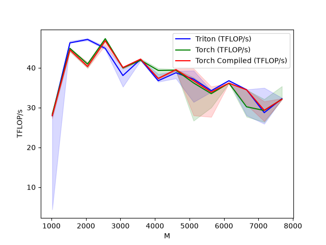
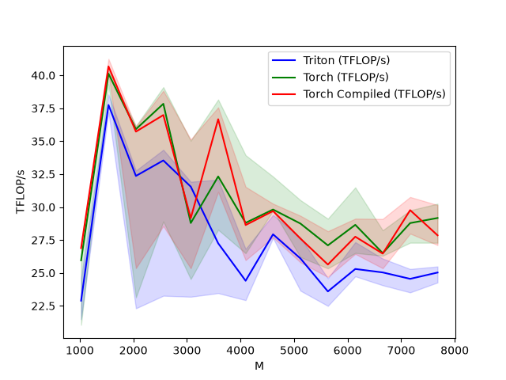

# Flash Attention

## An introduction

Attention is one of the most computationally expensive operations in transformers, and a major inefficiency of naive attention is the amount of intermediate memory traffic it generates. For a given sequence of length `N` and dimension `c`, a naive implementation would materialize a `(N, N)` intermediary matrix, taking up O(N^2) space. 

Flash attention attempts to ameliorate this issue by tiling Q, K, V matrices into smaller blocks. For a `(BLOCK_SIZE_M, C)` input Q matrix and a `(BLOCK_SIZE_N, C)` K matrix, the intermediate attention matrix materialized is only of size `(BLOCK_SIZE_M, BLOCK_SIZE_N)`. This eliminates the issue of materializing N^2 intermediates and reduces auxiliary space to O(N).

A brief explanation of the forward and backward pass is provided below. For a comprehensive explanation of the math behind Flash Attention (more specifically, FA2), feel free to peruse the papers below by Tri Dao and his team. 

<a href="https://arxiv.org/pdf/2205.14135"> Flash Attention </a>
 
<a href="https://tridao.me/publications/flash2/flash2.pdf"> Flash Attention V2 </a>

## Forward pass

A standard attention algorithm goes as follows

$$
S = \frac{QK^T}{\sqrt{d_k}}\\
$$
$$ P = softmax(S)\\ $$
$$
O = P \cdot V
$$

- When we tile our $Q$ into `(BLOCK_SIZE_M, C)` and $K^T$ into `(C, BLOCK_SIZE_N)`, the resultant attention matrix is `(BLOCK_SIZE_M, BLOCK_SIZE_N)`. The core issue with this is we do not have the entire row due to the tiling of $K^T$. Therefore, we cannot directly calculate our softmax as it requires knowing the maximum of the row and the sum of the exponentiated elements of the row. To do this, we utilize online softmax. 
- In online softmax, we maintain a running maximum $m_i$, and a running normalization term $l_i$, representing the sum of exponentiated scores processed so far. Whenever we encounter a new max, we simply scale down $l_{i-1}$ by $max_{i-1} - max_i$ prior to adding the new exponentiated tile. 
$$l_i = l_{i-1} \cdot e^{m_{i-1} - m_i} + \sum_j e^{s_j - m_i} $$
- Therefore, for a given Q tile, we can calculate its softmax by loading all relevant KV tiles and utilizing online softmax. 
- Once the softmax is calculated, we can simply calculate $O$ and accumulate it. Similarly, we have to scale down $O$ whenever there is a new max.

$$O_i = O_{i-1} \cdot e^{m_{i-1} - m_i} + P_iV_i$$

- Note: For FA2, the tile probabilities are kept unnormalized during accumulation and normalization by $l_i$ is deferred to the end of the loop to reduce redundant calculations.

## Backward pass

A naive backward pass is as follows

$$
dV = P^T \cdot dO $$
$$
dP = dO \cdot V^T 
$$
$$
dS = P \odot (dP - D), 
$$
$$
\text{ where } D_i = \sum_d O_id \cdot dO_id
$$

- Intuition behind D (delta): In a probability vector, the individual probabilities are tightly coupled with each other. If one probability goes up, another probability must go down. When we get a gradient dP, it is essentially an indication of how much each probability needs to change. However, if dP is something like [2, 3, 4], it cannot be that all our probabilities increase. Instead, we find a 'weighted baseline gradient' in the form of D and find $dP - D$. Elements whose upstream gradient lies above the weighted baseline receive a positive logit gradient, while those below it receive a negative one.

- Similar to the forward pass, there exists a O(N^2) bottleneck in materializing the intermediate $dP$. In the fused backward pass, we notice that D_i is repeatedly required when reconstructing dS during backwards pass. To reduce the recomputation, we precompute row-wise vector D and load the relevant tile when needed. Considering it is of size `{BATCH, HEAD, SEQ_LEN}`, it is relatively inexpensive to compute, store and load when needed compared to the heavier matrices like $Q$, $V$ and $K$. 

- In order to calculate $dK$ and $dV$, we can simply utilize a KV-centric loop to compute the resultant $dK, dV$, loading the relevant $Q^T$ and  $D$ tiles for each column. Intermediate matrices like $P$ and $S$ are computed on the fly as it is faster to recompute than to store and load a `(N, N)` matrice.

- To calculate dQ, one approach is to launch a separate kernel and proceed with a Q-centric loop to compute the dQ tile. Again, the intermediates are computed to find dQ.

## Benchmarking

Specifications for benchmark:
- CUDA: 13.2
- GPU: NVIDIA RTX 4080 GPU (16GB, Ada Lovelace architecture)
- Triton 3.7.0
- PyTorch 2.12.0
- Input shape: (BATCH_SIZE, HEADS, SEQ_LEN, HEAD_DIM)  `BATCH SIZE = 2, HEADS = 4, SEQ LEN in [1024, 7680], HEAD DIM=64, causal=False`
- Benchmarking: Each configuration was run repeatedly within a 500ms window and the 20th percentile, median and 80th percentile times were reported.
- Metric: TFLOPS
- Attention Backend: SDPBackend.FLASH_ATTENTION
- Dtype: FP16

 
*TFLOP/s is used because attention contains several large tensor-core matrix multiplications and is substantially more compute-intensive than standalone softmax or layer normalization. Throughput is computed using the algorithmic operation counts $4BHN^2d$ for the forward pass and $10BHN^2d$ for the backward pass, divided by runtime.

### **Forward**
 

### **Backward**
 

## Observations 
- The custom Triton kernel was able to match both Torch kernels for the forward pass, and achieved near even throughput for the backward (80-90%). 
- Initially, the attention mechanism relied on a two pass approach for the backward kernel after preprocessing D. The first pass to calculate dK and dV, and the second pass to calculate dQ. However, this achieved only 50% of Torch's throughput. This was largely due to the fact that S, P, dS and dP were recomputed within the dQ loop, leading to redundant matmuls and calculations. To address this, I instead adopted a one-pass approach computing dQ within the KV centric loop. Instead of computing a one-off dQ tile, the tile is accumulated across different KV programs. Multiple KV-owning programs contribute to the same dQ rows, creating write races. I therefore used atomic additions to accumulate partial dQ contributions safely. Overall, the approach managed to improve throughput by 50% relative to the original implementation. 
- Further improvements that could potentially be implemented in the future include a two pass approach utilizing memory buffers as shown in the layer norm approach, and allocating kernels such that there is greater KV ownership over a Q tile, leading to less contention. 
