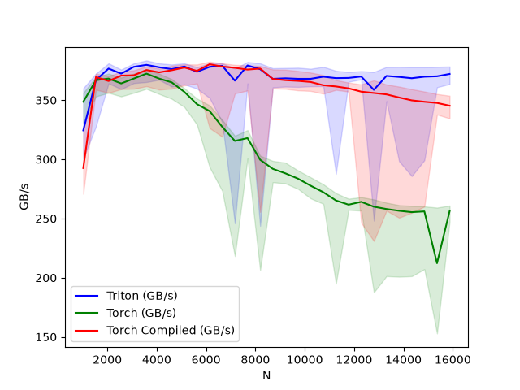
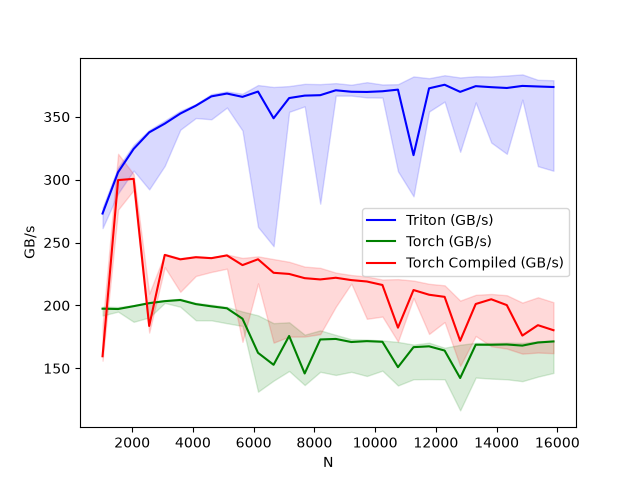
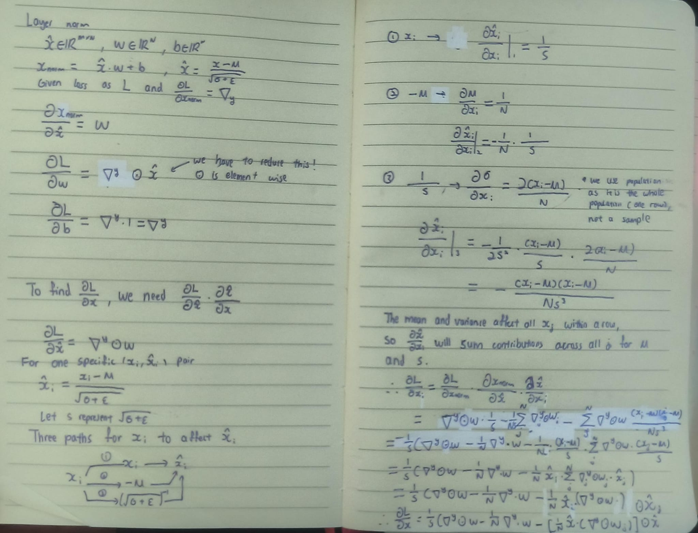

# Layer Norm 

## An introduction

Much like our softmax layer, a naive implementation of layer normalization would take too many read and writes. To recap, the formula to normalize one row is

$$
\hat{x}_i = \frac{x_i - \mu}{\sqrt{\sigma^2 + \epsilon}} \text{ where }\sigma^2 \text{ is variance and }\epsilon \text{ is added to prevent division by 0}
$$ 

and

$$
y = \hat{x} * w + b 
$$ 

## Fused layer norm forward pass

Instead of multiple read and writes, we can parallelize and fuse the forward pass with one kernel. Each row is treated as an independent population, and can be treated as such in our parallelization. 

So, we simply convert our input tensor into a 2D tensor and launch n_row programs to normalize each row

## Fused layer norm backward pass

The backward pass is more interesting. 

$$
\nabla_w = \sum_{rows} \nabla_y \odot \hat{x}
$$

$$
\nabla_b = \sum_{rows} \nabla_y
$$

$$
\nabla_x = \frac{1}{s}(\nabla_y \odot w - (\frac{1}{N} \hat{x} \cdot (\nabla_y \odot w)) \odot \hat{x} - \frac{1}{N}\nabla_y \cdot w) \text{, where s represents } \sqrt{\sigma^2 + \epsilon}
$$

You can find the handwritten derivation for the backward pass here [Backward Derivation](#backward-derivation)

As mentioned, each row is independent from each other, and hence we can calculate $\nabla_x$ in parallel. 
However, one issue with parallelism in this case is that $\nabla_w$ and $\nabla_b$ require an accumulation of gradients over all our input rows.
When the rows are treated in parallel, we must coordinate how this accumulation is being done. This can be done in two stages:

**Stage 1**
1. We calculate our dx and write it to its corresponding row first. 
2. For $\nabla_w$ and $\nabla_b$, we must use a lock approach to prevent race conditions during gradient accumulation (two rows writing to the same memory address at the same time). We use indivisible atomic operations to read and change the value of the lock with `tl.atomic_cas` and `tl.atomic_xchg`, and only write when our lock is open. 
3. To speed up the process, instead of thousands of rows writing to the same dw and db address, we split our rows into groups of `GROUP_SIZE_M`. Each group writes to a pre-allocated buffer to compute partial sums $\nabla_w$ and $\nabla_b$. 

**Stage 2**
1. Stage 2 then launches a new kernel to accumulate our buffers into a final $\nabla_w$ and $\nabla_b$. 

 

## Benchmarking

Specifications for benchmark:
- CUDA: 13.2
- GPU: NVIDIA RTX 4080 GPU (16GB, Ada Lovelace architecture)
- Triton 3.7.0
- PyTorch 2.12.0
- Input shape: (M, N),  $M = 4096, N \in [512, 15872]$
- Benchmarking: Each configuration was run 500 times and the 20th percentile, median and 80th percentile times were reported.
- Metric: Effective memory bandwidth (GB/s), computed assuming one read and one write per element:

### **Forward pass**

 

- The custom Triton implementation matches the performance of compiled Torch within the dimensions of the benchmark, with an increasing divergence in performance as context size increases.
- Triton's throughput saturates at about 370 GB/s, suggesting that the kernel has saturated its achievable performance for this particular workload.

### **Backward pass**

 

- The custom Triton kernel significantly outperforms both native PyTorch and torch.compile for the tested dimensions, reaching approximately 350 GB/s compared with 200+ GB/s for the PyTorch implementations.

# Backward Derivation
