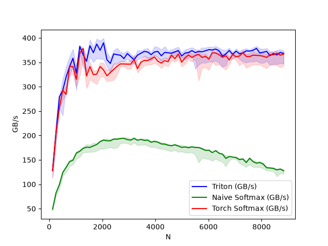
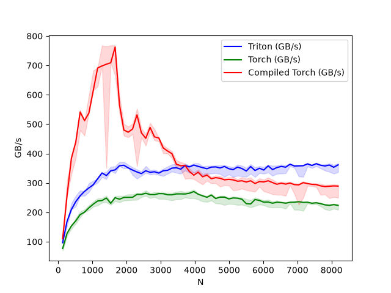
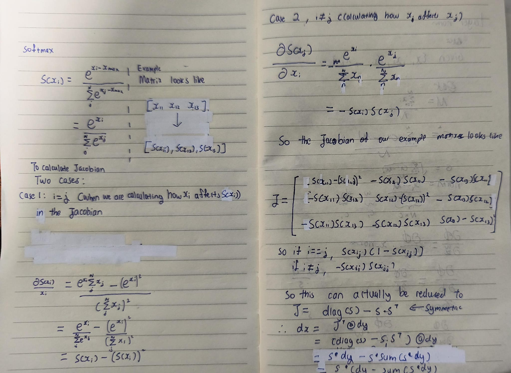

# Introduction

A naive softmax implementation without memory optimization and operation fusion performs multiple passes over global memory, producing intermediate tensors after each operation. This results in approximately 8MN+4M element transfers between HBM and on-chip memory, making the kernel memory-bound. The Triton implementation fuses these operations into a single kernel, reducing the required global memory traffic to one read and one write per element. For a detailed explanation of the naive softmax explanation, see the [Softmax Explanation](#softmax-explanation).

 

# Fused softmax forward pass

Instead of reading and writing the (M, N) matrix multiple times, we aim to process all five steps in one read, and write the softmax output in one write.
To do so, we launch a kernel with grid (num_rows, 1, 1) with num_rows number of programs. Each program is responsible for processing one row, and the GPU scheduler allocates how many programs occupies one SM.
Each program loads one row into on-chip memory, computes the complete softmax, and writes the result back to global memory.

### Some considerations
- Since our kernel is reductive (.sum, .max), it is much faster if we use a power of 2 as triton is optimized for these sizes and loads memory blocks in powers of 2 (64, 128, 256 ...). This means when we want to load our row, we need to load it with a BLOCK_SIZE equivalent to the next largest power of 2. So a row with 700 columns would be loaded with `BLOCK_SIZE = 1024`. We use a mask to ensure these values do not affect our calculations.
- `num_warps` determines how many warps we use for our program. More warps hide our latency as we can swap between warps on a memory load. But this also increases register pressure per program, leading to less programs per SM. So we autotune this value. 

 

# Fused softmax backward pass 

Similar to our forward pass, we can launch a (num_rows, 1, 1) grid of programs to process our rows. For each row, we simply calculate the partial derivative of the loss with respect to each element in the row and write it to the corresponding row in our dx matrix. To see the derivation, see the [Backward Derivation](#backward-derivation)

 

# Bench Marking

The moment of Truth!
Specifications for benchmark:
- CUDA: 13.2
- GPU: NVIDIA RTX 4080 GPU (16GB, Ada Lovelace architecture)
- Triton 3.7.0
- PyTorch 2.12.0
- Input shape: (M, N),  $M = 1024, N \in [128, 8960]$
- Benchmarking: Each configuration was run 5 times and the average execution time was reported.
- Metric: Effective memory bandwidth (GB/s), computed assuming one read and one write per element:

 

### Methodology:
We(I) benchmarked each implementation on a dedicated CUDA stream to minimize interference from unrelated GPU work. For each benchmark point, the kernel is executed 500 times, and the median runtime is reported to reduce the effects of runtime variability (e.g., GPU frequency scaling, thermal throttling, and scheduling noise). The input matrices of shape (M,N), where M is fixed at 512 and N varies from 128 to 8192 in increments of 128.
 
 

### **Forward**

### ***Backward***

## Observations
- Both torch and Triton kernels outperform the naive implementation, confirming that kernel fusion is the dominant optimization.
- Triton matches/outperforms Torch's forward softmax function in terms of effective bandwidth for most N values within the constraints of my benchmark.
- Both implementations plateau around 350 GB/s, suggesting that the kernel has saturated its achievable performance for this particular workload.
- Rapid increase in GB/s for small sizes of N, likely attributed to under-utilization, scheduling costs and overall kernel launch overhead when N is small.
- Within the constraints of this benchmark, Triton significantly outperforms Torch for the softmax backward pass. Honestly I'm not quite sure why I'll take a look at the torch internals when I have time and come back with updates.

 

# Softmax Explanation

The softtmax function is given by $\text{softmax}(x_i)=\frac{e^{x_i - max}}{\sum_j e^{x_j - max}}$.

- Softmax, when implemented naively without optimizations, operates as follows:
    1. For a (M, N) matrix, each row is loaded from HBM into registers/shared memory, the maximum value of that row is computed, and the resulting maximum is written to HBM. MN read and M writes.
    2. To calculate x - x_max, we read the (M, N) x matrix and (M, ) x_max matrix. We then write back a (M, N) matrix. We subtract x_max to prevent floating-point overflow. So we read MN + M elements and write back MN elements.
    3. Then, we need to exponentiate x to find the numerator in the softmax function. This is another MN read AND a MN write. 
    4. Then we need to load the new numerator (M, N) matrix again, and sum each row to find the normalization factor/denominator, producing a (M, ) vector. This is a MN read and a M write as we write back the normalization factor back to the HBM.
    5. Finally, we need to load both our numerators (M, N) and denominators (M, ) from the HBM to SRAM. We calculate our softmax and write back a (M, N) array. This is a MN + M read from the HBM and a MN write back to the HBM.
    
    In total, the naive implementation performs 5MN+2M reads and 3MN+2M writes, for a total of 8MN+4M element transfers between HBM and the GPU's on-chip memory. Since memory bandwidth is significantly lower than the computational throughput of the Streaming Multiprocessors (SMs), the kernel becomes memory-bound: the SMs spend a significant fraction of execution time waiting for data to arrive from global memory rather than performing arithmetic.

# Backward Derivation

