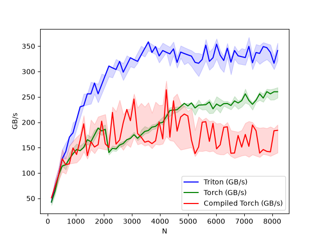
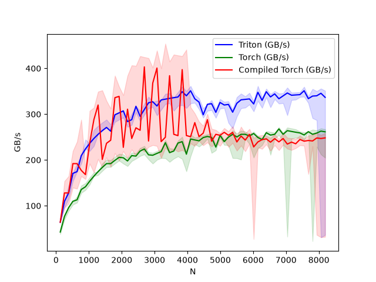
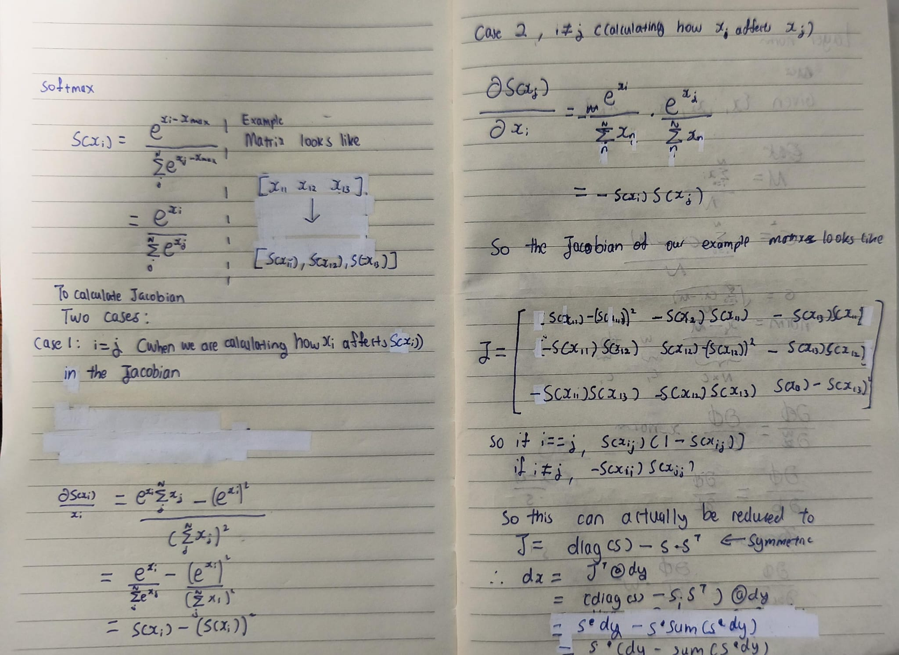

# Introduction

A naive softmax implementation without memory optimization and operation fusion performs multiple passes over global memory, producing intermediate tensors after each operation. This results in approximately 8MN+4M element transfers between HBM and on-chip memory, making the kernel memory-bound. The Triton implementation fuses these operations into a single kernel, reducing the required global memory traffic to one read and one write per element.

 

# Fused softmax forward pass

Instead of reading and writing the (M, N) matrix multiple times, we aim to process all five steps in one read, and write the softmax output in one write.
We can do so by splitting our sequence into (BLOCK_SIZE_M, DIM) tiles, where each tile consists of BLOCK_SIZE_M number of rows. This is possible because each row is independent from another, and we can calculate our softmax for each tile. 

 

# Fused softmax backward pass 

Similar to our forward pass, we can split our tiles into BLOCK_SIZE_M sized tiles where we can calculate its derivative. To see the derivation, see the [Backward Derivation](#backward-derivation)

 

# Bench Marking

Specifications for benchmark:
- CUDA: 13.2
- GPU: NVIDIA RTX 4080 GPU (16GB, Ada Lovelace architecture)
- Triton 3.7.0
- PyTorch 2.12.0
- Input shape: (M, N),  $M = 512, N \in [128, 8192] in steps of 128$
- Benchmarking: Each configuration was run within a 500ms window and the 20th percentile, median and 80th percentile times were reported.
- Metric: Effective memory bandwidth (GB/s), computed assuming one read and one write per element for forward and two reads and one write for backward.
- Dtype: FP16

 

### Methodology:
For each benchmark point, the kernel is executed as many times as possible within a 500ms window, and the median runtime is reported to reduce the effects of runtime variability (e.g., GPU frequency scaling, thermal throttling, and scheduling noise). The input matrices of shape (M,N), where M is fixed at 512 for our forward and backward pass, and N varies from 128 to 8192 in increments of 128. 
 
 

### **Forward**

### ***Backward***

## Observations
- The custom Triton kernel outperforms the compiled Torch and native Torch kernels for FP16 inputs for its forward pass, and matches the compiled throughput for smaller sequence lengths in the backward pass. 
- The custom Triton kernel approaches an effective throughput of about 350 GB/s for both forward and backward passes. This indicates that the current implementation has reached a stable performance bottleneck. Further profiling would be required to determine whether this is primarily memory bandwidth, occupancy, register pressure, or reduction overhead.
- Based on autotuning results, the optimal `BLOCK_SIZE_M` fluctuates between 1 and 2. This is a reasonable result as rows are completely independent in the softmax. This means that there is no data reuse and increasing BLOCK_SIZE_M simply increases the size of the `(BLOCK_SIZE_M * BLOCK_SIZE_N)` tile loaded with no increase in arithmetic intensity. This could lead to decreased occupancy and heightened register pressure for larger values of BLOCK_SIZE_M. A block size of 2 may occasionally benefit parallelism without significant detriment to occupancy and register pressure. 

 

# Softmax Explanation

The softmax function is given by $\text{softmax}(x_i)=\frac{e^{x_i - max}}{\sum_j e^{x_j - max}}$.

- Softmax, when implemented naively without optimizations, operates as follows:
    1. For a (M, N) matrix, each row is loaded from HBM into registers/shared memory, the maximum value of that row is computed, and the resulting maximum is written to HBM. MN read and M writes.
    2. To calculate x - x_max, we read the (M, N) x matrix and (M, ) x_max matrix. We then write back a (M, N) matrix. We subtract x_max to prevent floating-point overflow. So we read MN + M elements and write back MN elements.
    3. Then, we need to exponentiate x to find the numerator in the softmax function. This is another MN read AND a MN write. 
    4. Then we need to load the new numerator (M, N) matrix again, and sum each row to find the normalization factor/denominator, producing a (M, ) vector. This is a MN read and a M write as we write back the normalization factor back to the HBM.
    5. Finally, we need to load both our numerators (M, N) and denominators (M, ) from the HBM to SRAM. We calculate our softmax and write back a (M, N) array. This is a MN + M read from the HBM and a MN write back to the HBM.
    
    In total, the naive implementation performs 5MN+2M reads and 3MN+2M writes, for a total of 8MN+4M element transfers between HBM and the GPU's on-chip memory. Since memory bandwidth is significantly lower than the computational throughput of the Streaming Multiprocessors (SMs), the kernel becomes memory-bound: the SMs spend a significant fraction of execution time waiting for data to arrive from global memory rather than performing arithmetic.

# Backward Derivation

